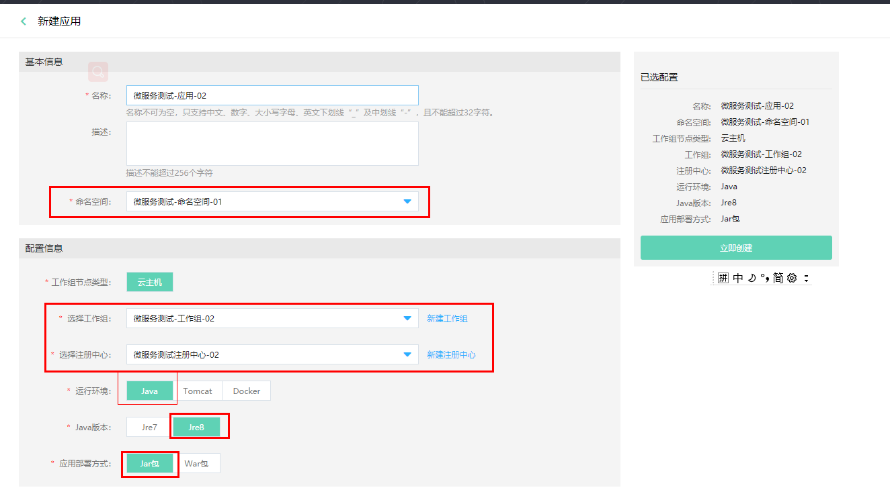

# 微服务使用示例

## 1.网络准备

创建私有网络


CIDR选择默认：10.0.0.0/16


## 2.微服务配置

### 1.资源管理

#### 1.1创建注册中心

```
首先创建注册中心
```


```
选择刚才创建的工作组网络
```

注册中心创建成功后


点击详细查看注册中心地址：


```
记录eureka信息:
http://reg.eureka-0.center-w8t9t6hnm.com:8761	
http://reg.eureka-1.center-w8t9t6hnm.com:8762
http://reg.eureka-2.center-w8t9t6hnm.com:8763
```

#### 1.2创建工作组

1.2.1创建子网


创建子网成功


1.2.2 创建云主机资源

```
云主机资源（目前支持）
​	镜像：CentOS 7.6 64位
​	需绑定弹性公网IP
​	使用刚才创建的子网
​	安全组选择【默认安全组开放全部端口】
```


创建云主机成功：


```
创建云主机成功后查看公网IP是否正常，后续步骤中会涉及远程到云主机资源中做相应的操作；
```

1.2.3 创建工作组


```
1.选择刚才创建的云主机资源
2.下图命令请远程到选中的云主机中执行
```


```
3.远程到已选择的云主机执行下面命令：
执行：wget -c https://microservice.s3.cn-east-2.jdcloud-oss.com/getPublickey.sh -P /root && bash /root/getPublickey.sh https://microservice.s3.cn-east-2.jdcloud-oss.com/registry
提示：具体命令已实际系统中命令为准
```


```
执行成功见上图
```

创建工作组成功：


### 2.应用管理

#### 2.1创建命名空间


#### 2.2创建应用管理

 

```
选择运行环境：Java
选择Java版本：jre8
选择部署方式：Jar包
```


3.软件中心管理

1.创建软件仓库 


2.上传应用jar（测试jar详情见下方[**2.1构建测试应用**]）


2.1.构建测试应用


application.yml

```
#端口号
spring:
  application:
    name: spring-cloud-book-service
  profiles:
    active: test
server:
  port: 8880

test:
  version: 0.0.1

eureka:
  instance:
    preferIpAddress: true
  client:
    service-url:
    # 配置刚才创建的注册中心中eureka地址
      defaultZone: http://reg.eureka-0.center-w8t9t6hnm.com:8761/eureka/
    register-with-eureka: true
```

构建自己的jar


#### 2.3应用发布


 


#### 2.4应用发布成功后验证

```
第一步：
查看在创建工作组时创建的云主机资源的弹性公网IP
114.67.111.182
114.67.111.173
第二步：
访问测试应用【ip:测试应用端口/API接口】
http://114.67.111.173:8880/getVersion
```


### 3.配置管理

#### 1.应用配置

1.1创建应用配置


1.2.配置当前配置文件到测试应用


1.3.验证配置文件是否成功


```
端口：8881
版本：0.1.1
```

#### 2.回滚


回滚后验证：


#### 3.全局配置

3.1.创建全局配置文件


3.2.点击发布


3.3.验证发布


